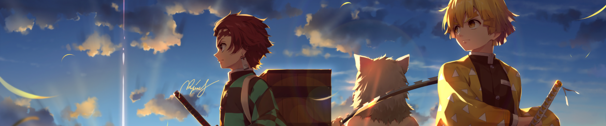
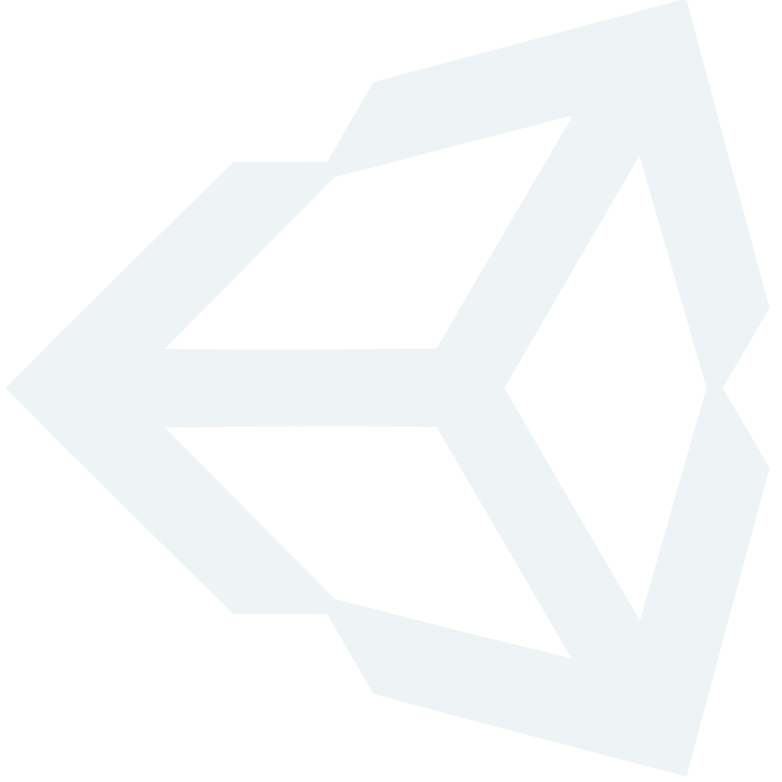

<h1 align="center">Hi 👋, I'm Shayan</h1>

<h3 align="center">BSc. Computer Engineering Student @ Bilkent Üniversitesi | </h3>

 

<!--
<table>
  <tbody>
    <tr>
        <td valign="top" colspan="3" width="20%">
          <h1 align="center"><picture></picture> Projects</h1>
        </td>
    </tr>
    <tr>
      <td colspan="3">
        
<i>Use CTRL + click to open links in new tab. </i>

      </td>
    </tr>
    <tr>
          <td align="center" valign="top" width="20%">
              
          </td>
          <td align="center" valign="top" width="20%">
            <a href="https://github.com/SCORPIA2004/AvASys-Ground-Control-System">
            <picture>  </picture>
            </a>
          </td>
          <td align="center" valign="top" width="20%">
            
          </td>
    </tr>
    <tr>
      <td>
        <h3 align="center"><a href="https://github.com/SCORPIA2004/CampusConnect">Campus Connect</a></h3>
      </td>
      <td>
        <h3 align="center"><a href="https://github.com/SCORPIA2004/AvASys-Ground-Control-System">AvASys v1.2.2</a></h3>
      </td>
      <td>
        <h3 align="center"><a href="https://github.com/SCORPIA2004/STARS-Autologger">STARS Autologger</a></h3>
      </td>
    </tr>
    <tr>
      <td>
        A social webapp that connects students together 
        <a href="https://www.figma.com/file/R8BZfCFKQJQwLtaQgkhAHL/Undefined?type=design&node-id=107%3A2&mode=design&t=aNN8YGzyDwz2Z1lV-1" target="blank">Figma</a> | 
        <a href="https://youtu.be/J5G0Qc4Uwq0">Demo</a>
          
         MongoDB | ExpressJS | React | NodeJS 
      </td>
      <td>
        <h3></a></h3>
         Flight controller - uses AdaFruit Ultimate GPS + Arduino
          
         MongoDB | ExpressJS | React | NodeJS 
      </td>
      <td>
        <h3></a></h3>
        Automated logger using Python and Selenium
          
         MongoDB | ExpressJS | React | NodeJS 
    </tr>
  </tbody>  
</table> 
-->

<table>
  <thead>
    <tr>
      <th>Name</th>
      <th>Description</th>
      <th>Languages/Tools</th>
    </tr>
    <tr>
      <td colspan="3">
        
<i>Use CTRL + click to open links in new tab. </i>

      </td>
    </tr>
  </thead>
  <tbody>
    <tr>
      <td><a href="https://github.com/SCORPIA2004/CampusConnect">Campus Connect</a></td>
      <td>A social webapp that connects students together <a href="https://www.figma.com/file/R8BZfCFKQJQwLtaQgkhAHL/Undefined?type=design&node-id=107%3A2&mode=design&t=aNN8YGzyDwz2Z1lV-1" target="blank">Figma</a> | <a href="https://youtu.be/J5G0Qc4Uwq0">Demo</a></td>
      <td>MongoDB | ExpressJS | React | NodeJS</td>
    </tr>  
    <tr>
      <td><a href="https://github.com/SCORPIA2004/AvASys-Ground-Control-System" target="blank">AvASys v1.2.2</a></td>
      <td>Flight controller - uses AdaFruit Ultimate GPS + Arduino</td>
      <td>Python | Pyside6 | QtDesigner</td>
    </tr>  
    <tr>
      <td><a href="https://github.com/SCORPIA2004/STARS-Autologger" target="_blank">STARS Autologger</a></td>
      <td>Automated logger using Python and Selenium</td>
      <td>Python | Selenium</td>
    </tr>
    <tr>
      <td><a href="https://github.com/SCORPIA2004/IMDb-data-multi-tool" target="_blank">IMDb data multi tool</a></td>
      <td>Automated data scrapper using Python Selenium webdriver</td>
      <td>Python | Selenium | Beautiful Soup</td>
    </tr>
    <tr>
      <td><a href="https://github.com/SCORPIA2004/Urokodaki" target="_blank">Restaurant Menu</a></td>
      <td>Interactive restaurant menu made with React.js and JavaScript</td>
      <td>React | JavaScript</td>
    </tr>
    <tr>
      <td><a href="https://scorpia2004.itch.io/martian-racer" target="_blank">Martian Racer</a></td>
      <td>Unity game engine-based game, Martian Racer</td>
      <td>C# | Unity</td>
    </tr>
    <tr>
      <td><a href="https://finance-s4.herokuapp.com/" target="_blank">Finance S4</a></td>
      <td>Finance app created with JavaScript + Jinja during CS50x</td>
      <td>JavaScript | Jinja</td>
    </tr>
    <tr>
      <td><a href="https://youtu.be/ioeeD3LapDI" target="_blank">Card game</a></td>
      <td>Card game developed with Java and Vaadin Framework</td>
      <td>Java | Vaadin</td>
    </tr>
    <tr>
      <td><a href="https://scorpia2004.github.io/Brainnest-Frontend/Assignment%202%20-%20CSS/index.html" target="_blank">Interactive website</a></td>
      <td>Interactive website created with HTML, CSS, and JavaScript</td>
      <td>HTML | CSS | JavaScript</td>
    </tr>
    <tr>
      <td><a href="https://scorpia2004.github.io/Brainnest-Frontend/Assignment%204%20-%20JS_2/RPS/index.html" target="_blank">Rock Paper Scissors</a></td>
      <td>Simple game created with HTML, CSS, and JavaScript</td>
      <td>HTML | CSS | JavaScript</td>
    </tr>  </tbody>
</table>

<h2 align="center"></picture>Connect with me</h2>

<h3 align="left">Languages and Tools:</h3>

 
   
   
   
   
   
   
   
  

<!--- 
&nbsp;
 --->
